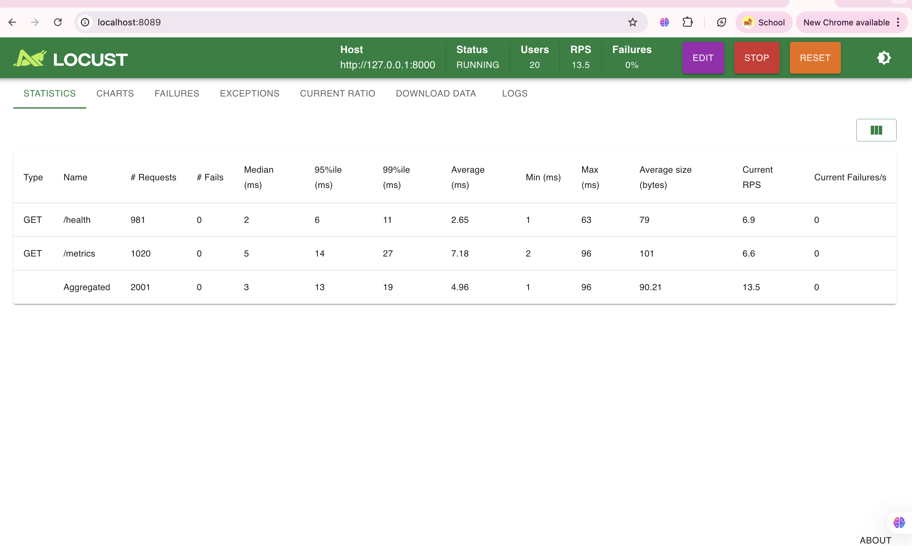
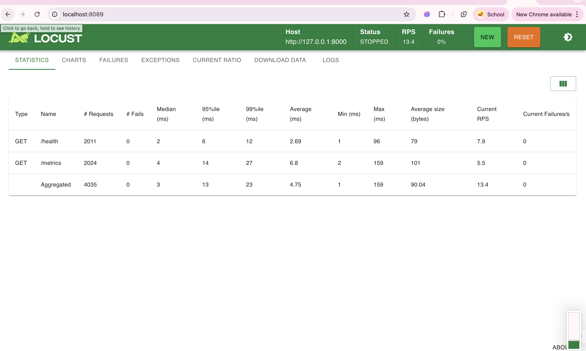

# Cassava Leaf Disease Classifier

A machine learning pipeline that classifies cassava leaves as either **Healthy** or infected with **Bacterial Blight**, built with MobileNetV2, FastAPI, and Flutter.

---

## Video Demo

YouTube: [`[https://youtu.be/6jAWdGQehgc]`](https://www.youtube.com/watch?v=6jAWdGQehgc)

---

## Live URL

API:[ https://mlop-summative-production.up.railway.app](https://mlop-summative-production.up.railway.app/)

API Docs: [`https://mlop-summative-production.up.railway.app/docs`](https://mlop-summative-production.up.railway.app/docs)

---

## Project Description

This project demonstrates an end-to-end ML pipeline for cassava leaf disease detection. Due to low accuracy when classifying all cassava diseases, the model was scoped to a binary classification task — distinguishing between **Healthy** leaves and leaves infected with **Bacterial Blight**. This focus significantly improved model performance.

The pipeline covers data acquisition, preprocessing, model training, evaluation, deployment, and retraining — all accessible through a Flutter mobile app and a FastAPI backend.

---

## Tech Stack

- **Model:** MobileNetV2 (Transfer Learning) — TensorFlow / Keras
- **API:** FastAPI
- **UI:** Flutter (Mobile)
- **Deployment:** Railway (Docker)
- **Load Testing:** Locust

---

## Project Structure

```
MLOP-Summative/
├── README.md
├── Dockerfile
├── requirements.txt
├── notebook/
│   └── cassava_classifier.ipynb
├── src/
│   ├── api.py
│   ├── prediction.py
│   ├── retrain.py
│   └── insights.py
├── data/
│   ├── train/
│   │   ├── healthy/
│   │   └── bacterial_blight/
│   └── new_data/
├── models/
│   └── cassava_binary_final.keras
└── ui/
    └── flutter_app/
```

---

## Setup Instructions

### 1. Clone the repository

```bash
git clone https://github.com/Glorycodess/MLOP-Summative.git
cd MLOP-Summative
```

### 2. Install dependencies

```bash
pip install -r requirements.txt
```

### 3. Run the API locally

```bash
uvicorn src.api:app --reload
```

Then open `http://localhost:8000/docs` to test all endpoints.

### 4. Run with Docker

```bash
docker build -t cassava-api .
docker run -p 7860:7860 cassava-api
```

Then open `http://localhost:7860/docs`

---

## API Endpoints

| Method | Endpoint | Description |
|--------|----------|-------------|
| GET | `/` | Home |
| GET | `/health` | Model status and uptime |
| GET | `/metrics` | Accuracy and class distribution |
| POST | `/predict` | Predict a single leaf image |
| POST | `/upload-data` | Upload new images for retraining |
| POST | `/retrain` | Trigger model retraining |

---

## How to Use

### Predict a leaf
Send a POST request to `/predict` with an image file. The model returns:
- Predicted class (Healthy / Bacterial Blight)
- Confidence score
- Class probabilities

### Retrain the model
1. Open the Flutter app and go to the **Upload/Train** tab
2. Select multiple images and choose a label (`healthy` or `bacterial_blight`)
3. Tap **Upload & Train** — images are saved to the server and retraining starts automatically
4. To retrain again on already saved data, go to the **Retrain** tab and tap **Retrain Model**
5. Check the **Home** tab to see the updated accuracy after retraining

---

## Flood Request Simulation (Locust)

Locust was used to simulate concurrent users sending requests to the `/predict` endpoint.

### Run Locust locally

```bash
pip install locust
locust -f locustfile.py --host=https://mlop-summative-production.up.railway.app
```

Then open `http://localhost:8089` and set number of users.

## Load Testing Results

### Run 1


### Run 2


| Docker Containers | Requests/sec | Avg Latency | Failures |
|-------------------|-------------|-------------|----------|
| 1 |13.4 | 4.75 ms| 0% |
| 2 |N/A |N/A | N/A|
| 3 | N/A| N/A| N/A|

### Scaling Observation

The system was tested using a single container deployment.

While multiple container scaling (horizontal scaling) was not implemented in this project, the results demonstrate that the system performs efficiently under concurrent load in a single-instance setup.

Future improvements would include deploying multiple containers behind a load balancer to evaluate scalability under higher traffic.

---

## Model Performance

| Metric | Value |
|--------|-------|
| Model | MobileNetV2 (Transfer Learning) |
| Classes | Healthy, Bacterial Blight |
| Validation Accuracy | `[0.67]` |
| Validation Loss | `[0.52]` |

---

## GitHub Repository

`https://github.com/Glorycodess/MLOP-Summative`
